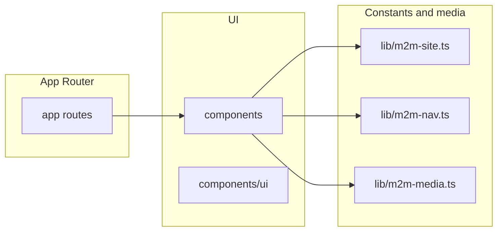

# Architecture — source of truth

**Canonical technical overview** of this repository for humans and agents.  
For workflow, see [WORKFLOW.md](./WORKFLOW.md). For visual rules, see [BRAND_CONSTITUTION.md](./BRAND_CONSTITUTION.md). For cross-site polish principles vs execution log, see [M2M_VISUAL_POLISH_SYSTEM_PASS_2026.md](./M2M_VISUAL_POLISH_SYSTEM_PASS_2026.md) vs [WORK_ORDER.md](./WORK_ORDER.md).

## System shape

## Runtime and stack

- **Framework:** Next.js 16 (App Router), React 19.
- **Styling:** Tailwind CSS 4, tokens in `app/globals.css` (`@theme`, `--font-*`, `m2m-*` colors).
- **UI primitives:** Radix-based shadcn-style under `components/ui/`.
- **Analytics:** `@vercel/analytics` in `app/layout.tsx`.
- **Content:** Mostly static TS/TSX and per-route `content.ts` files; no in-repo database.

## Shared layout and conversion primitives

Use these for consistent width, rhythm, and CTAs (see [M2M_WEBSITE_OVERHAUL_MASTER_PLAN.md](./M2M_WEBSITE_OVERHAUL_MASTER_PLAN.md)):

| Module | Role |
|--------|------|
| `components/m2m-layout.tsx` | `M2mContainer` (max-width + horizontal padding aligned with header), `M2mSection`, `M2mProse` |
| `components/m2m-cta.tsx` | `M2mConsultationCta` (Calendly book link, gold vs outline cream), `m2mOutlineGoldLinkClass` for in-page links on green |
| `lib/m2m-form.ts` | Shared class strings for forms: campaign leads (`m2mLeadField*`, `m2mPlaybook*`), interior light pages (`m2mInterior*`), dark panels (`m2mDarkPanel*`) — pair with `components/ui/input`, `label`, `textarea`, `button` |

Header and global footer use `M2mConsultationCta` and `M2mContainer` where applicable; campaign footers use `M2mContainer` for the same horizontal rhythm.

## Directory responsibilities

| Path | Role |
|------|------|
| `app/` | Routes, `layout.tsx`, `page.tsx`, metadata; root `loading.tsx` shows branded shell during slow navigations |
| `components/` | Page sections, layout chrome (`header`, `footer`), feature folders (`buy/`, `sell/`, …) |
| `lib/` | `m2m-site.ts`, `m2m-nav.ts`, `m2m-media.ts`, `m2m-seo-metadata.ts` (shared `title` / Open Graph / Twitter defaults), `m2m-form.ts`, `utils.ts`, etc. |
| `public/` | Static assets; `public/brand/`, route-specific image folders with `.gitkeep` |
| `.cursor/` | Skills and slash-command prompts |

## Page patterns

1. **Core marketing pages** (e.g. home, buy, sell, resources): `Header`, optional `GSAPAnimations`, `main` often `bg-white`, global `Footer`. Some older routes nest `Footer` inside `main` — prefer matching home: `Footer` sibling to `main` for new work unless touching legacy layout.
2. **Campaign landings** (e.g. `/fha-loan`, `/improve-your-credit`, `/va-loan-benefits`): `Header` with `consultationCtaVariant="outlineCream"`, `main` with `bg-m2m-panel`, sections composed from `components/<campaign>/`, **`DivorceLandingFooter`** (luxury footer) — not the global `Footer` unless intentionally unified.
3. **Partner / referral interior** (e.g. `/get-license-in-va`): standard `Header` + light `main` + global `Footer` for site consistency.

## Routing reference

See [diagrams/site-routes.md](./diagrams/site-routes.md) for a grouped route list.  
**Dynamic:** `app/blog/[slug]/page.tsx` (SSG with `generateStaticParams`).

## Images

- Use `next/image`.
- Remote hosts must match `next.config.mjs` → `images.remotePatterns` (Vercel Blob for `M2M_MEDIA`, etc.).

## CI

- `npm run ci` → lint, Vitest, `tsc`, `next build`, Playwright e2e.
- **`next build`** runs the TypeScript pass as part of the production build; this repo does **not** set `typescript.ignoreBuildErrors` (types must be clean for deploy).

## External CRM boundary

GoHighLevel integration is now an active project, and the architectural boundary is:
- the website repo owns lead capture, server-side submission, thank-you UX, and analytics wiring
- GoHighLevel owns CRM records, pipelines, automations, calendars, routing, and reporting
- Slack/Zapier/direct-mail/AI layers remain external operational systems unless scope is explicitly expanded

Source of truth for that boundary: [M2M_GHL_INTEGRATION_MASTER_PLAN.md](./M2M_GHL_INTEGRATION_MASTER_PLAN.md)

Lead API responses use classified error **`code`** values (`crm_*`, `validation_error`, etc.), user-facing copy in [`lib/m2m-lead-submit-error-copy.ts`](../lib/m2m-lead-submit-error-copy.ts), and HTTP status mapping in [`app/api/submit-lead/route.ts`](../app/api/submit-lead/route.ts). See [M2M_GHL_OPERATOR_VERIFICATION.md](./M2M_GHL_OPERATOR_VERIFICATION.md) §4.

## Out of scope (today)

- Supabase, auth middleware, RLS, Stripe — not part of this repo unless explicitly added.
- Rebuilding all CRM / automation behavior directly inside the website repo — keep GHL operational logic in GHL wherever possible, and keep the site focused on lead capture, secure server-side submission, and clean UX.
