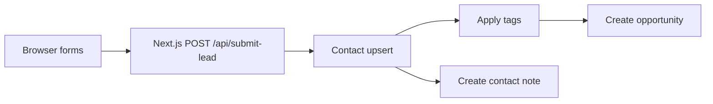

# Marching 2 More — website to GoHighLevel system guide

**Last updated:** April 24, 2026  
**Audience:** Engineers, GHO operators, and anyone who needs a **single** accurate picture of how public leads get into GoHighLevel after live QA.

**Related:** [M2M_GHL_INTEGRATION_MASTER_PLAN.md](./M2M_GHL_INTEGRATION_MASTER_PLAN.md) (scope and business context) · [M2M_GHL_OPERATOR_VERIFICATION.md](./M2M_GHL_OPERATOR_VERIFICATION.md) (env, assumptions, triage) · [M2M_LEAD_CAPTURE_MATRIX.md](./M2M_LEAD_CAPTURE_MATRIX.md) (route-by-route fields).

---

## 1. What this integration does

- The **Next.js** marketing site is the **lead-capture and attribution** layer: forms, UTMs, short conversion UX.
- **GoHighLevel (GHO / GHL API)** is the **system of record** for **contacts, custom fields, tags, pipelines, opportunities, workflows, and reporting** after the handoff.
- The browser **never** receives CRM secrets. The only public endpoint is **`POST /api/submit-lead`**.

---

## 2. Single submission path

- **All production-wired lead forms** submit JSON to **`POST /api/submit-lead`** (client helper: [`lib/m2m-lead-submit.ts`](../lib/m2m-lead-submit.ts); handler: [`app/api/submit-lead/route.ts`](../app/api/submit-lead/route.ts); orchestration: [`lib/ghl/submit-lead.ts`](../lib/ghl/submit-lead.ts)).
- Runtime: **Node.js** on the server. Validation: [`lib/ghl/validate.ts`](../lib/ghl/validate.ts) (Zod).
- If `GHL_DRY_RUN=true`, the server does **not** call GHO; use only for local UI/JSON testing — not proof of field IDs.

---

## 3. Buyer vs seller routing

- Every request includes **`lead_type`:** `"buyer"` or `"seller"` (set by the form / page, not inferred server-side from copy).
- **Custom field `GHL_CF_LEAD_TYPE`** receives the strings **`Buyer`** or **`Seller`** (capital B/S) — [lead-mapping](../lib/ghl/lead-mapping.ts).
- **Tags** come from `GHL_TAG_LEAD_BUYER` and `GHL_TAG_LEAD_SELLER` (comma-separated). Intended production names: **`M2M - Buyer`** and **`M2M - Seller`** (exact spelling in GHO).
- **Optional extra tags** by pathname: `GHL_PATH_TAGS` (format: `/path:Tag A|Tag B,/other:Tag C` — [config](../lib/ghl/config.ts) `parsePathTags`).
- **Opportunities** (when all four pipeline env vars are set):
  - **Buyer** → pipeline **`GHL_BUYER_PIPELINE_ID`**, first stage **`GHL_BUYER_STAGE_NEW_INQUIRY_ID`** (human name: **M2M Buyer Pipeline** / **New Inquiry** in the M2M account).
  - **Seller** → **`GHL_SELLER_PIPELINE_ID`**, **`GHL_SELLER_STAGE_NEW_INQUIRY_ID`** (**M2M Seller Pipeline** / **New Inquiry**).
  - Name pattern: `M2M Web — Buyer|Seller — {full name}` ([submit-lead](../lib/ghl/submit-lead.ts)).
- If **any** of the four pipeline/stage env vars is missing, submission now fails fast with a configuration error and does **not** render a success state in the browser.

---

## 4. Where each kind of data lands in GHO

| Data | Where in GHO | Notes |
|------|----------------|------|
| Identity (name, email, phone) | Contact record | Phone omitted from upsert when empty; E.164 when present |
| `date_of_birth` | Custom field `GHL_CF_DOB` | `YYYY-MM-DD` when provided |
| `address` | Custom field `GHL_CF_ADDRESS` — label **Property Address** in GHO | Omitted when empty |
| `urgency` | Custom field `GHL_CF_URGENCY` — must be the **TEXT** field ID, **not** a separate dropdown Urgency | Optional strings; short forms use shared defaults from [`lib/m2m-lead-urgency.ts`](../lib/m2m-lead-urgency.ts) |
| `lead_type` | `GHL_CF_LEAD_TYPE` | `Buyer` / `Seller` |
| UTMs | `GHL_CF_UTM_SOURCE` … `UTM_CONTENT` | Empty UTM values are omitted, not sent as blank |
| `notes` | **Contact notes** | `POST /contacts/:id/notes` after upsert — [`createContactNote`](../lib/ghl/client.ts) |
| Pipelines / stage | **Opportunity** on the right pipeline, **New Inquiry** | Requires four env vars; see §3 |
| Funnel tags | Contact tags | Base buyer/seller tags + optional `GHL_PATH_TAGS` |

**GHO is source of truth** for what workflows fire, what the pipeline board shows, and how reporting aggregates leads — the website only delivers the lead payload and stable metadata (`source_path`, `correlationId` in logs/response).

---

## 5. Truths (production contract)

- **All production lead forms** in this matrix submit through **`POST /api/submit-lead`** (see [M2M_LEAD_CAPTURE_MATRIX.md](./M2M_LEAD_CAPTURE_MATRIX.md)).
- **GHO is the source of truth** for contacts, opportunities, tags, and automation behavior once the lead is in the sub-account.
- **Buyer** leads (when fully configured) align to: **M2M Buyer Pipeline**, **New Inquiry**, **M2M - Buyer** (tag).
- **Seller** leads align to: **M2M Seller Pipeline**, **New Inquiry**, **M2M - Seller** (tag).
- **`urgency` is stored in the TEXT custom field** bound to `GHL_CF_URGENCY`, **not** a different dropdown Urgency field if the account has both.
- **Property Address** in GHO maps from **`GHL_CF_ADDRESS`** in env.
- **DOB** and **Urgency (TEXT)** can be **written successfully** and still be **hard to see** in the default GHO contact view until those fields are **on the contact record layout** (or opened from the full custom-field list). **Successful population ≠ visible layout.**
- **Where to verify in order:** (1) **Contacts** (2) **Custom fields** (3) **Tags** (4) **Notes** (5) **Opportunities / pipeline board** — see [M2M_GHL_OPERATOR_VERIFICATION.md](./M2M_GHL_OPERATOR_VERIFICATION.md) §3.10.

---

## 6. Strict success contract (no partial-success success states)

- Order of operations: **upsert contact** → **tags** → **opportunity** → **note** — [§3.9 in operator doc](./M2M_GHL_OPERATOR_VERIFICATION.md).
- If the **first** step (upsert) fails, the API returns **`ok: false`**, a **`code`** (often `crm_*`), and a **`correlationId`**.
- If any later required step fails (`contacts_tags`, `opportunities_create`, `contacts_note`), the API now returns **`ok: false`** with `failed_step`, `code`, and `correlationId`.
- Browser UIs should only show thank-you states when the server returns `ok: true` after full pipeline completion.
- **Always** use **`correlationId`** to join browser → Vercel → GHO when debugging.

---

## 7. Operator gotchas (known)

1. **TEXT urgency vs dropdown** — Look at the field tied to `GHL_CF_URGENCY`, not a differently labeled dropdown.
2. **Contact layout** — Urgency and DOB may be **in the data** but **not on the default contact screen** until GHO admin adds them to the layout.
3. **Tag spelling** — Env tags must match GHO **byte-for-byte** (ASCII hyphen, spaces).
4. **Empty tag env** — If buyer/seller tag lists are empty, submission fails as a configuration issue (no success state).
5. **“No opportunity”** — Usually means incomplete pipeline **env** in Vercel, and now correctly presents as a failed submission (no false success).
6. **Notes** — Operator note creation is part of the required success path; note failures now block success.

---

## 8. Key code files

| File | Role |
|------|------|
| [`app/api/submit-lead/route.ts`](../app/api/submit-lead/route.ts) | HTTP entry, `correlationId`, maps errors to status codes |
| [`lib/ghl/submit-lead.ts`](../lib/ghl/submit-lead.ts) | Orchestration, strict success contract, logging |
| [`lib/ghl/lead-mapping.ts`](../lib/ghl/lead-mapping.ts) | Custom fields, tags, pipeline resolution |
| [`lib/ghl/client.ts`](../lib/ghl/client.ts) | Upsert, tags, opportunity, **notes** |
| [`lib/ghl/config.ts`](../lib/ghl/config.ts) | Env loading, `GHL_PATH_TAGS` |
| [`lib/m2m-lead-submit.ts`](../lib/m2m-lead-submit.ts) | Browser `fetch` to `/api/submit-lead` |

---

## 9. Client-facing summary

A shorter, non-technical handoff: [M2M_CLIENT_CRM_HANDOFF_GUIDE.md](./M2M_CLIENT_CRM_HANDOFF_GUIDE.md).
