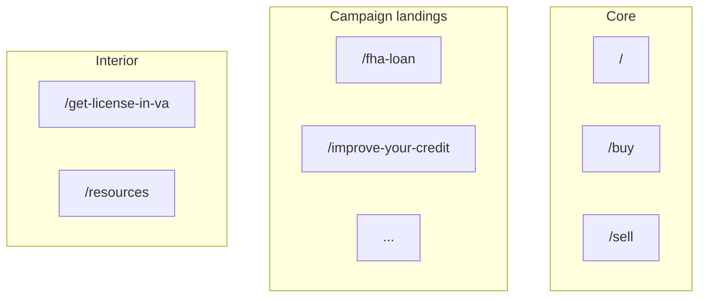

# Site routes (grouped)

**Non-exhaustive** grouping for agent orientation. Authoritative list: `app/**/page.tsx`.

## Core

- `/` — Home
- `/buy`, `/sell`, `/partners`, `/reviews`, `/blog`, `/blog/[slug]`

## Contact and team

- `/contact-us`, `/contact` (legacy alias if configured)
- `/our-team`, `/team` (alias if configured)
- `/profile-page`, `/roger-lee`, `/kristin-s-profile`

## Tools and search

- `/home-search`, `/free-home-valuation`, `/home-valuation` (alias if configured), `/cma-form`

## Resources and policies

- `/resources`, `/cookie-policy`, `/privacy-policy`, `/terms-and-conditions`, `/accessibility-statement`, `/copy-of-privacy-policy`

## Campaign / landing (often not in hamburger)

- `/fha-loan`, `/improve-your-credit`, `/more-investments`, `/navigating-divorce`
- `/downsizing-your-home`, `/va-loan-benefits`, `/facing-foreclosure`

*(Hamburger inventory may omit some campaign URLs—see `lib/m2m-nav.ts`.)*

## Other interior

- `/get-license-in-va` — Moseley Virginia salesperson licensing (referral landing)

